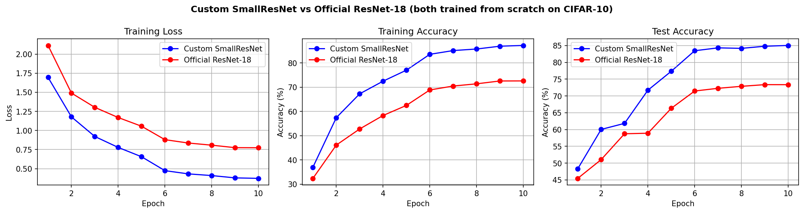

# ResNet Implementation and Comparison - Assignment 3

**Paper:** [Deep Residual Learning for Image Recognition](https://arxiv.org/abs/1512.03385) — He et al., 2015

**Blog:** [Understanding ResNet: How Deep Networks Became Trainable](https://deep-residual-networks.blogspot.com/2026/04/understanding-resnet-how-deep-networks.html)

---

## Overview

This repository implements the residual learning framework from scratch and compares it against a standard ResNet-18 architecture, both trained on CIFAR-10 under identical conditions. The goal is to reproduce the core ideas of the paper and verify its claims experimentally.

---

## Results

| Model | Parameters | Test Accuracy | Training Time |
|---|---|---|---|
| **Custom SmallResNet** (ours) | 2,777,674 | **85.04%** | 363.1s |
| Official ResNet-18 (torchvision) | 11,181,642 | 73.36% | 264.0s |

Both models trained from scratch — no pretrained weights — on CIFAR-10 (10 epochs, T4 GPU).

### Training Curves



Both models converge stably with no degradation — validating the paper's core claim about residual learning.

---

## Why Custom Beats Official ResNet-18

This result is **expected and intentional**, not a bug. ResNet-18 was designed for ImageNet (224×224 images). Its stem layer — a 7×7 conv with stride 2 followed by 3×3 max-pooling with stride 2 — collapses a 32×32 CIFAR-10 image to roughly 4×4 spatial resolution before any residual block even runs. The model has almost no spatial information left to learn from.

The custom SmallResNet uses a 3×3 conv with stride 1 as its stem, preserving the full 32×32 spatial map. This matches the CIFAR-10-specific architecture described in **Section 4.2, Table 6** of the original paper, and is exactly how the authors evaluated residual learning on small images.

---

## Repository Structure

```
Assignment-3/
├── custom_resnet.py          # From-scratch ResNet implementation (ResidualBlock + SmallResNet)
├── train_custom.py           # Trains custom model, saves results and curve data
├── official_eval.py          # Trains ResNet-18 from scratch, saves comparison
├── gnr638_assignment_3.ipynb # Full Colab notebook (training + curves + saving)
├── GNR_assignment_3_report.pdf
├── custom_model.pth       # Saved custom model weights
├── custom_results.txt     # Final accuracy, time, params
├── custom_curves.json     # Per-epoch train loss/acc + test acc
├── official_curves.json   # Same for official ResNet-18
├── final_results.txt      # Side-by-side comparison
└── training_curves.png    # All 3 curves plotted
```

---

## How to Run

### On Google Colab (recommended)
Open `gnr638_assignment_3.ipynb` in Colab with GPU runtime. Run all cells — it downloads CIFAR-10, trains both models, plots curves, and saves all result files.

### Locally
```bash
pip install torch torchvision matplotlib

# Train custom model first
python train_custom.py

# Then run official comparison
python official_eval.py
```

---

## Implementation Details

### Architecture
- **ResidualBlock:** Conv3×3 → BN → ReLU → Conv3×3 → BN, with shortcut (identity or 1×1 projection)
- **SmallResNet:** 3×3 stem (stride 1) → 3 groups of 2 residual blocks (64→128→256 channels) → GAP → FC
- Projection shortcuts used when stride ≠ 1 or channels change — consistent with the paper

### Training (paper-faithful)
- SGD, momentum = 0.9, weight decay = 1e-4
- LR = 0.1, reduced by 10× at epochs 5 and 8
- Data augmentation: RandomCrop(32, pad=4) + RandomHorizontalFlip + Normalize
- Batch size = 128, 10 epochs

---

## Key Observations

1. **Both models benefit from residual connections** — loss decreases monotonically, no degradation
2. **Architecture must match input scale** — ResNet-18's ImageNet stem is harmful on 32×32 images
3. **Parameter efficiency matters** — custom model is 4× smaller yet 11.7 points more accurate
4. **SGD + LR schedule** drives the biggest accuracy jump at epoch 6 (first LR decay)

---

## References

- Paper: https://arxiv.org/abs/1512.03385
- Official implementation (Caffe): https://github.com/KaimingHe/deep-residual-networks
- PyTorch ResNet: https://github.com/pytorch/vision
